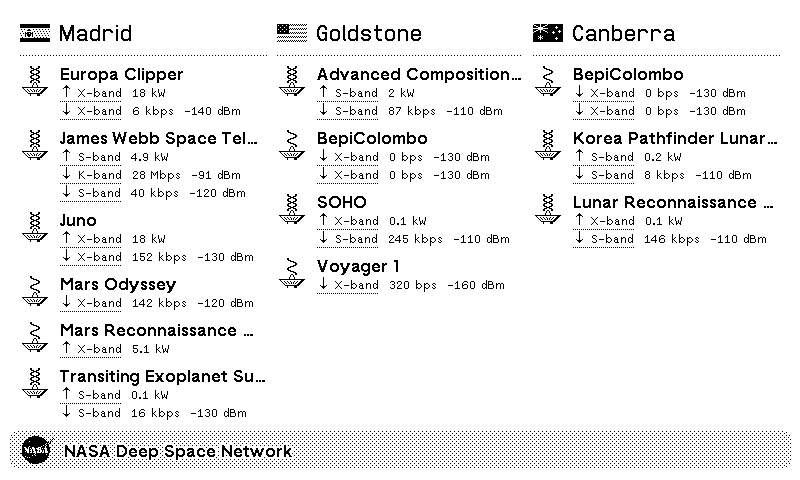

# NASA Deep Space Network Private Plugin for TRMNL

**[See a live preview!](https://trmnl-dsn.netlify.app/)**

This [TRMNL](https://usetrmnl.com/) plugin displays the current status of the [Deep Space Network](https://www.nasa.gov/directorates/somd/space-communications-navigation-program/what-is-the-deep-space-network/): its three ground-based stations in Spain, the United States, and Australia, and the spaceborne satellites with which they communicate.

Data is provided by NASA's [DSN Now](https://eyes.nasa.gov/apps/dsn-now/dsn.html).



# Easy Installation: Use the Screenshot Plugin

Add a new [Screenshot](https://help.usetrmnl.com/en/articles/10302121-screenshot) plugin to your TRMNL playlist, and point it at the URL `https://trmnl-dsn.netlify.app/`

The page is updated hourly, so the "Hourly" refresh rate is recommended.

# Hard Installation: Create a Custom Plugin

This is a private plugin, so it's not available in the plugin store. Follow the directions below to add it to your device.

## Step 1: Create a New Private Plugin

Log in to your TRMNL dashboard.
On the left-hand menu, click on the 'Go to Plugins' button.
Find the 'Private Plugin' Plugin to create a Private Plugin.
Click 'Add new' to create a new Private Plugin.

## Step 2: Set up the Polling Strategy

Name your plugin (e.g., "Deep Space Network") then scroll down to the Strategy section.
Choose the Polling strategy from the Strategy dropdown menu.
In the Polling URL field, enter this URL:

```
https://trmnl-dsn.netlify.app/dsn.json
```

Click Save. Once it is saved, the 'Edit Markup' button is now available.

## Step 3: Add the HTML Markup

Click the 'Edit Markup' button.

Copy and paste the following code into the Markup box.

```html
<div class="layout layout--col gap--large">
  <div class="columns">
    
    <div
      class="column"
      data-list-limit="true"
      data-list-max-height="320"
      data-list-hidden-count="true"
    >
      <div class="flex layout--center gap">
        
        <span class="title">{{ station.name }}</span>
      </div>

      <div class="b-h-gray-3"></div>

      
      <div class="item">
        <div class="content">
          <div class="flex gap">
            <div class="flex flex--col gap--small">
              
            </div>
            <div>
              <span class="title title--small">{{ craft.name }}</span>

               
              <div class="flex gap">
                <span class="label label--small label--underline">
                  ↑ {{ sig.band }}-band
                </span>
                <span class="label label--small">{{ sig.power }}</span>
              </div>
              
              <div class="flex gap">
                <span class="label label--small label--underline">
                  ↓ {{ sig.band }}-band
                </span>
                <span class="label label--small"> {{ sig.data_rate }} </span>
                <span class="label label--small"> {{ sig.power }} </span>
              </div>
              
            </div>
          </div>
        </div>
      </div>
      
      <span class="label label--gray-out"> No active communications </span>
      
    </div>
    
  </div>
</div>
<div class="title_bar">
  
  <span class="title">NASA Deep Space Network</span>
</div>
```

## Step 4: Save and Activate the Plugin

Once you have entered the markup, click Save to store the plugin.

Change the refresh rate to "Hourly".

Navigate to the Playlists tab in your TRMNL dashboard.

Drag and drop your new Deep Space Network plugin to the top of your playlist if not automatically added.

## Step 5: View the Dashboard on Your Device

Once refreshed, your TRMNL device will display the Deep Space Network status.

# Self-Hosting on Netlify

The rendered page and JSON data files are publicly hosted on Netlify at https://trmnl-dsn.netlify.app/dsn.json (updating hourly), so you don't have to do these steps unless you really want to!

Create a new Netlify site with the following settings:

- **Base directory:** (empty)
- **Build command:** `bundle exec ./generate.rb`
- **Publish directory:** `_site`
- **Environment variables:** Add `BASE_URL` with the value of the site URL without the trailing slash, e.g. `https://[app-name].netlify.app`

After publishing, the site should be live with two files published:

- https://[my-app].netlify.app/ - an HTML preview of the dashboard
- https://[my-app].netlify.app/dsn.json - the data to be polled by the private plugin

To keep the JSON data up-to-date, you will need to set up a cron job that periodically calls the [build hook](https://docs.netlify.com/configure-builds/build-hooks/) for the site – ideally the same as the plugin's polling interval.
